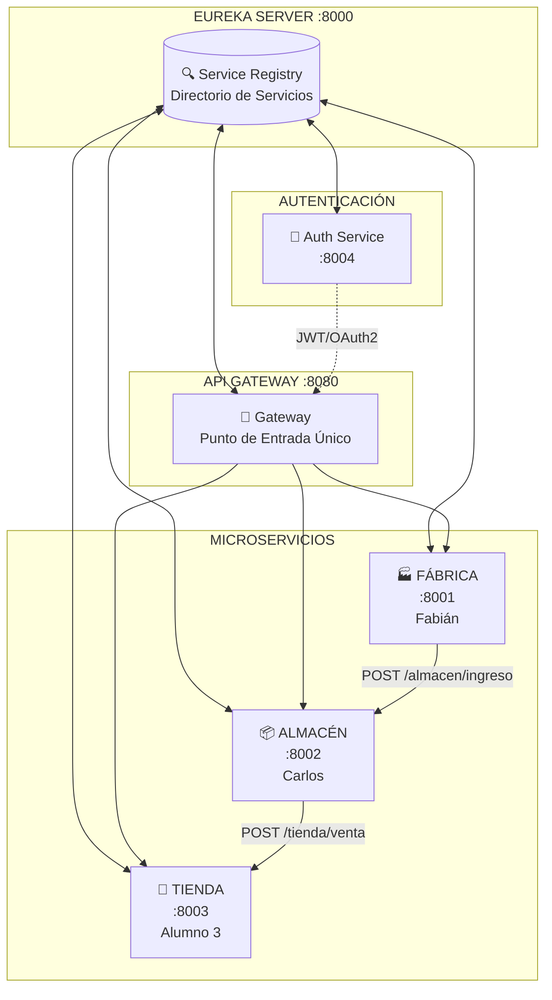

# 🥛 Guía de Implementación: Microservicios de Lácteos

## Sistema de Cadena de Suministro: Fábrica → Almacén → Tienda

---

## 📋 Descripción General

Este proyecto implementa una arquitectura de microservicios para gestionar el flujo de lotes de productos lácteos a través de tres procesos: **Fábrica**, **Almacén** y **Tienda**.

### Arquitectura del Sistema



### JSON del Lote (Estructura Base)

```json
{
  "loteId": "LOT-001",
  "producto": "Leche Gloria",
  "cantidad": 100,
  "origen": "FABRICA",
  "destino": "ALMACEN",
  "fechaProduccion": "2025-12-16",
  "estado": "EN_TRANSITO"
}
```

---

## 🔒 Esquema de Seguridad

| Servicio | Tipo de Seguridad | Responsable |
|----------|-------------------|-------------|
| **Fábrica** | Basic Auth | Fabián |
| **Almacén** | JWT (JSON Web Token) | Carlos |
| **Tienda** | OAuth2 (Simulado) | Alumno 3 |
| **API Gateway** | Validación centralizada | Todos |

---

## 👨‍💻 FABIÁN - Microservicio FÁBRICA

### Responsabilidad
Crear el microservicio de Fábrica que produce lotes de lácteos y los envía al Almacén.

### Puerto: `8001`

### Seguridad: **Basic Authentication**

### Estructura del Proyecto

```
ms-fabrica/
├── src/main/java/com/lacteos/fabrica/
│   ├── FabricaApplication.java
│   ├── config/
│   │   └── SecurityConfig.java          # Basic Auth
│   ├── controller/
│   │   └── FabricaController.java
│   ├── model/
│   │   └── LoteLeche.java
│   ├── service/
│   │   └── FabricaService.java
│   └── client/
│       └── AlmacenClient.java           # Feign Client
├── src/main/resources/
│   └── application.properties
└── pom.xml
```

### Dependencias Maven (pom.xml)

```xml
<dependencies>
    <!-- Spring Boot Web -->
    <dependency>
        <groupId>org.springframework.boot</groupId>
        <artifactId>spring-boot-starter-web</artifactId>
    </dependency>
    
    <!-- Spring Security (Basic Auth) -->
    <dependency>
        <groupId>org.springframework.boot</groupId>
        <artifactId>spring-boot-starter-security</artifactId>
    </dependency>
    
    <!-- Eureka Client -->
    <dependency>
        <groupId>org.springframework.cloud</groupId>
        <artifactId>spring-cloud-starter-netflix-eureka-client</artifactId>
    </dependency>
    
    <!-- OpenFeign (llamadas entre servicios) -->
    <dependency>
        <groupId>org.springframework.cloud</groupId>
        <artifactId>spring-cloud-starter-openfeign</artifactId>
    </dependency>
</dependencies>
```

### Código a Implementar

#### 1. FabricaApplication.java
```java
@SpringBootApplication
@EnableDiscoveryClient
@EnableFeignClients
public class FabricaApplication {
    public static void main(String[] args) {
        SpringApplication.run(FabricaApplication.class, args);
    }
}
```

#### 2. LoteLeche.java (Modelo)
```java
public class LoteLeche {
    private String loteId;
    private String producto;
    private int cantidad;
    private String origen;
    private String destino;
    private LocalDate fechaProduccion;
    private String estado;
    
    // Constructores, getters, setters
}
```

#### 3. SecurityConfig.java (Basic Auth)
```java
@Configuration
@EnableWebSecurity
public class SecurityConfig {

    @Bean
    public SecurityFilterChain filterChain(HttpSecurity http) throws Exception {
        http
            .csrf(csrf -> csrf.disable())
            .authorizeHttpRequests(auth -> auth
                .requestMatchers("/fabrica/**").authenticated()
                .anyRequest().permitAll()
            )
            .httpBasic(Customizer.withDefaults());
        return http.build();
    }

    @Bean
    public UserDetailsService userDetailsService() {
        UserDetails user = User.builder()
            .username("fabrica")
            .password(passwordEncoder().encode("grupo123"))
            .roles("FABRICA")
            .build();
        return new InMemoryUserDetailsManager(user);
    }

    @Bean
    public PasswordEncoder passwordEncoder() {
        return new BCryptPasswordEncoder();
    }
}
```

#### 4. FabricaController.java
```java
@RestController
@RequestMapping("/fabrica")
public class FabricaController {

    @Autowired
    private FabricaService fabricaService;

    // Crear nuevo lote
    @PostMapping("/producir")
    public ResponseEntity<LoteLeche> producirLote(@RequestBody LoteLeche lote) {
        lote.setOrigen("FABRICA");
        lote.setDestino("ALMACEN");
        lote.setFechaProduccion(LocalDate.now());
        lote.setEstado("PRODUCIDO");
        return ResponseEntity.ok(fabricaService.producirYEnviar(lote));
    }

    // Ver lotes producidos
    @GetMapping("/lotes")
    public ResponseEntity<List<LoteLeche>> listarLotes() {
        return ResponseEntity.ok(fabricaService.obtenerLotes());
    }

    // Enviar lote a almacén
    @PostMapping("/enviar/{loteId}")
    public ResponseEntity<LoteLeche> enviarAAlmacen(@PathVariable String loteId) {
        return ResponseEntity.ok(fabricaService.enviarAAlmacen(loteId));
    }
}
```

#### 5. AlmacenClient.java (Feign Client)
```java
@FeignClient(name = "ms-almacen")
public interface AlmacenClient {
    
    @PostMapping("/almacen/ingreso")
    LoteLeche enviarLote(@RequestBody LoteLeche lote,
                         @RequestHeader("Authorization") String token);
}
```

### application.properties
```properties
spring.application.name=ms-fabrica
server.port=8001

# Eureka
eureka.client.service-url.defaultZone=http://localhost:8000/eureka
eureka.instance.prefer-ip-address=true

# Seguridad (para logs)
logging.level.org.springframework.security=DEBUG
```

### Endpoints a Probar

| Método | Endpoint | Descripción | Auth |
|--------|----------|-------------|------|
| POST | `/fabrica/producir` | Crear nuevo lote | Basic Auth |
| GET | `/fabrica/lotes` | Listar lotes | Basic Auth |
| POST | `/fabrica/enviar/{loteId}` | Enviar a almacén | Basic Auth |

---

## 👨‍💻 CARLOS - Microservicio ALMACÉN

### Responsabilidad
Crear el microservicio de Almacén que recibe lotes de Fábrica y los distribuye a Tienda.

### Puerto: `8002`

### Seguridad: **JWT (JSON Web Token)**

### Estructura del Proyecto

```
ms-almacen/
├── src/main/java/com/lacteos/almacen/
│   ├── AlmacenApplication.java
│   ├── config/
│   │   └── SecurityConfig.java          # JWT Config
│   ├── controller/
│   │   └── AlmacenController.java
│   ├── model/
│   │   └── LoteLeche.java
│   ├── service/
│   │   └── AlmacenService.java
│   ├── security/
│   │   ├── JwtUtil.java                  # Generador/Validador JWT
│   │   ├── JwtRequestFilter.java         # Filtro de peticiones
│   │   └── AuthController.java           # Login endpoint
│   └── client/
│       └── TiendaClient.java             # Feign Client
├── src/main/resources/
│   └── application.properties
└── pom.xml
```

### Dependencias Adicionales (pom.xml)

```xml
<!-- JWT -->
<dependency>
    <groupId>io.jsonwebtoken</groupId>
    <artifactId>jjwt-api</artifactId>
    <version>0.11.5</version>
</dependency>
<dependency>
    <groupId>io.jsonwebtoken</groupId>
    <artifactId>jjwt-impl</artifactId>
    <version>0.11.5</version>
    <scope>runtime</scope>
</dependency>
<dependency>
    <groupId>io.jsonwebtoken</groupId>
    <artifactId>jjwt-jackson</artifactId>
    <version>0.11.5</version>
    <scope>runtime</scope>
</dependency>
```

### Código a Implementar

#### 1. JwtUtil.java (Generador de Tokens)
```java
@Component
public class JwtUtil {
    
    private String SECRET_KEY = "grupo123secretkeymuylargaparajwt256bits";
    
    public String generateToken(String username) {
        return Jwts.builder()
            .setSubject(username)
            .setIssuedAt(new Date())
            .setExpiration(new Date(System.currentTimeMillis() + 1000 * 60 * 60 * 10)) // 10 horas
            .signWith(Keys.hmacShaKeyFor(SECRET_KEY.getBytes()), SignatureAlgorithm.HS256)
            .compact();
    }
    
    public String extractUsername(String token) {
        return extractClaim(token, Claims::getSubject);
    }
    
    public boolean validateToken(String token, String username) {
        final String extractedUsername = extractUsername(token);
        return (extractedUsername.equals(username) && !isTokenExpired(token));
    }
    
    private boolean isTokenExpired(String token) {
        return extractClaim(token, Claims::getExpiration).before(new Date());
    }
    
    private <T> T extractClaim(String token, Function<Claims, T> claimsResolver) {
        final Claims claims = Jwts.parserBuilder()
            .setSigningKey(Keys.hmacShaKeyFor(SECRET_KEY.getBytes()))
            .build()
            .parseClaimsJws(token)
            .getBody();
        return claimsResolver.apply(claims);
    }
}
```

#### 2. JwtRequestFilter.java
```java
@Component
public class JwtRequestFilter extends OncePerRequestFilter {

    @Autowired
    private JwtUtil jwtUtil;

    @Override
    protected void doFilterInternal(HttpServletRequest request, 
                                    HttpServletResponse response, 
                                    FilterChain chain) throws ServletException, IOException {
        
        final String authHeader = request.getHeader("Authorization");
        String username = null;
        String jwt = null;

        if (authHeader != null && authHeader.startsWith("Bearer ")) {
            jwt = authHeader.substring(7);
            try {
                username = jwtUtil.extractUsername(jwt);
            } catch (Exception e) {
                // Token inválido
            }
        }

        if (username != null && SecurityContextHolder.getContext().getAuthentication() == null) {
            if (jwtUtil.validateToken(jwt, username)) {
                UsernamePasswordAuthenticationToken authToken = 
                    new UsernamePasswordAuthenticationToken(username, null, new ArrayList<>());
                SecurityContextHolder.getContext().setAuthentication(authToken);
            }
        }
        chain.doFilter(request, response);
    }
}
```

#### 3. AuthController.java (Endpoint de Login)
```java
@RestController
@RequestMapping("/auth")
public class AuthController {

    @Autowired
    private JwtUtil jwtUtil;

    @PostMapping("/login")
    public ResponseEntity<?> login(@RequestBody Map<String, String> credentials) {
        String username = credentials.get("username");
        String password = credentials.get("password");
        
        // Validación simple (en producción usar UserDetailsService)
        if ("almacen".equals(username) && "grupo123".equals(password)) {
            String token = jwtUtil.generateToken(username);
            return ResponseEntity.ok(Map.of("token", token));
        }
        return ResponseEntity.status(401).body("Credenciales inválidas");
    }
}
```

#### 4. SecurityConfig.java (JWT)
```java
@Configuration
@EnableWebSecurity
public class SecurityConfig {

    @Autowired
    private JwtRequestFilter jwtRequestFilter;

    @Bean
    public SecurityFilterChain filterChain(HttpSecurity http) throws Exception {
        http
            .csrf(csrf -> csrf.disable())
            .authorizeHttpRequests(auth -> auth
                .requestMatchers("/auth/**").permitAll()
                .requestMatchers("/almacen/**").authenticated()
                .anyRequest().permitAll()
            )
            .sessionManagement(session -> 
                session.sessionCreationPolicy(SessionCreationPolicy.STATELESS))
            .addFilterBefore(jwtRequestFilter, UsernamePasswordAuthenticationFilter.class);
        return http.build();
    }
}
```

#### 5. AlmacenController.java
```java
@RestController
@RequestMapping("/almacen")
public class AlmacenController {

    @Autowired
    private AlmacenService almacenService;

    // Recibir lote de fábrica
    @PostMapping("/ingreso")
    public ResponseEntity<LoteLeche> recibirLote(@RequestBody LoteLeche lote) {
        lote.setOrigen("ALMACEN");
        lote.setDestino("TIENDA");
        lote.setEstado("EN_ALMACEN");
        return ResponseEntity.ok(almacenService.registrarIngreso(lote));
    }

    // Ver inventario
    @GetMapping("/inventario")
    public ResponseEntity<List<LoteLeche>> verInventario() {
        return ResponseEntity.ok(almacenService.obtenerInventario());
    }

    // Enviar a tienda
    @PostMapping("/despachar/{loteId}")
    public ResponseEntity<LoteLeche> despacharATienda(@PathVariable String loteId) {
        return ResponseEntity.ok(almacenService.despacharATienda(loteId));
    }
}
```

### application.properties
```properties
spring.application.name=ms-almacen
server.port=8002

# Eureka
eureka.client.service-url.defaultZone=http://localhost:8000/eureka
eureka.instance.prefer-ip-address=true

# JWT Config
jwt.secret=grupo123secretkeymuylargaparajwt256bits
jwt.expiration=36000000
```

### Endpoints a Probar

| Método | Endpoint | Descripción | Auth |
|--------|----------|-------------|------|
| POST | `/auth/login` | Obtener JWT token | Sin auth |
| POST | `/almacen/ingreso` | Recibir lote | JWT Bearer |
| GET | `/almacen/inventario` | Ver stock | JWT Bearer |
| POST | `/almacen/despachar/{loteId}` | Enviar a tienda | JWT Bearer |

---

## 👨‍💻 ALUMNO 3 - Microservicio TIENDA

### Responsabilidad
Crear el microservicio de Tienda que recibe lotes del Almacén y gestiona ventas al cliente final.

### Puerto: `8003`

### Seguridad: **OAuth2 (Simulado con Resource Server)**

### Estructura del Proyecto

```
ms-tienda/
├── src/main/java/com/lacteos/tienda/
│   ├── TiendaApplication.java
│   ├── config/
│   │   └── SecurityConfig.java          # OAuth2 Resource Server
│   ├── controller/
│   │   └── TiendaController.java
│   ├── model/
│   │   ├── LoteLeche.java
│   │   └── Venta.java
│   └── service/
│       └── TiendaService.java
├── src/main/resources/
│   └── application.properties
└── pom.xml
```

### Dependencias Adicionales (pom.xml)

```xml
<!-- OAuth2 Resource Server -->
<dependency>
    <groupId>org.springframework.boot</groupId>
    <artifactId>spring-boot-starter-oauth2-resource-server</artifactId>
</dependency>
```

### Código a Implementar

#### 1. SecurityConfig.java (OAuth2 Simulado)
```java
@Configuration
@EnableWebSecurity
public class SecurityConfig {

    @Bean
    public SecurityFilterChain filterChain(HttpSecurity http) throws Exception {
        http
            .csrf(csrf -> csrf.disable())
            .authorizeHttpRequests(auth -> auth
                .requestMatchers("/tienda/public/**").permitAll()
                .requestMatchers("/tienda/**").authenticated()
                .anyRequest().permitAll()
            )
            // Simular OAuth2 usando JWT decoder local
            .oauth2ResourceServer(oauth2 -> oauth2
                .jwt(jwt -> jwt.decoder(jwtDecoder()))
            );
        return http.build();
    }

    @Bean
    public JwtDecoder jwtDecoder() {
        // En producción: usar issuer-uri de un Authorization Server real
        // Simulación con clave simétrica compartida con Almacén
        SecretKey key = Keys.hmacShaKeyFor(
            "grupo123secretkeymuylargaparajwt256bits".getBytes()
        );
        return NimbusJwtDecoder.withSecretKey(key).build();
    }
}
```

#### 2. TiendaController.java
```java
@RestController
@RequestMapping("/tienda")
public class TiendaController {

    @Autowired
    private TiendaService tiendaService;

    // Recibir lote de almacén
    @PostMapping("/venta")
    public ResponseEntity<LoteLeche> recibirLote(@RequestBody LoteLeche lote) {
        lote.setDestino("CLIENTE_FINAL");
        lote.setEstado("EN_TIENDA");
        return ResponseEntity.ok(tiendaService.recibirLote(lote));
    }

    // Ver productos disponibles
    @GetMapping("/productos")
    public ResponseEntity<List<LoteLeche>> verProductos() {
        return ResponseEntity.ok(tiendaService.obtenerProductos());
    }

    // Vender producto
    @PostMapping("/vender/{loteId}")
    public ResponseEntity<Venta> venderProducto(
            @PathVariable String loteId,
            @RequestParam int cantidad) {
        return ResponseEntity.ok(tiendaService.vender(loteId, cantidad));
    }

    // Endpoint público (sin auth)
    @GetMapping("/public/catalogo")
    public ResponseEntity<List<String>> verCatalogo() {
        return ResponseEntity.ok(List.of("Leche Gloria", "Yogurt Laive", "Queso Bonlé"));
    }
}
```

#### 3. Venta.java (Modelo adicional)
```java
public class Venta {
    private String ventaId;
    private String loteId;
    private String producto;
    private int cantidadVendida;
    private LocalDateTime fechaVenta;
    private double total;
    
    // Constructores, getters, setters
}
```

### application.properties
```properties
spring.application.name=ms-tienda
server.port=8003

# Eureka
eureka.client.service-url.defaultZone=http://localhost:8000/eureka
eureka.instance.prefer-ip-address=true

# OAuth2 Resource Server (para producción usar authorization server real)
# spring.security.oauth2.resourceserver.jwt.issuer-uri=http://auth-server:8004
```

### Endpoints a Probar

| Método | Endpoint | Descripción | Auth |
|--------|----------|-------------|------|
| GET | `/tienda/public/catalogo` | Catálogo público | Sin auth |
| POST | `/tienda/venta` | Recibir lote | OAuth2/JWT |
| GET | `/tienda/productos` | Ver stock | OAuth2/JWT |
| POST | `/tienda/vender/{loteId}` | Vender producto | OAuth2/JWT |

---

## ⚙️ Configuración del Eureka Server

El Eureka Server ya está configurado. Solo asegúrate de que:

### application.properties (Eureka Server)
```properties
spring.application.name=eurekaServer
server.port=8000

eureka.client.register-with-eureka=false
eureka.client.fetch-registry=false
eureka.client.service-url.defaultZone=http://localhost:8000/eureka
```

### Verificar que los microservicios se registren
Una vez que todos los servicios estén corriendo, visita:
```
http://localhost:8000
```

Deberías ver:
- MS-FABRICA
- MS-ALMACEN
- MS-TIENDA

---

## 🧪 Guía de Pruebas

### 1. Iniciar Servicios (en orden)

```bash
# Terminal 1 - Eureka Server
cd EurekaServeLacteosMicroservicios
./mvnw spring-boot:run

# Terminal 2 - Fábrica (Fabián)
cd ms-fabrica
./mvnw spring-boot:run

# Terminal 3 - Almacén (Carlos)
cd ms-almacen
./mvnw spring-boot:run

# Terminal 4 - Tienda (Alumno 3)
cd ms-tienda
./mvnw spring-boot:run
```

### 2. Probar Fábrica (Basic Auth)

```bash
# Producir un lote
curl -X POST http://localhost:8001/fabrica/producir \
  -u fabrica:grupo123 \
  -H "Content-Type: application/json" \
  -d '{
    "loteId": "LOT-001",
    "producto": "Leche Gloria",
    "cantidad": 100
  }'

# Ver lotes
curl -X GET http://localhost:8001/fabrica/lotes \
  -u fabrica:grupo123
```

### 3. Probar Almacén (JWT)

```bash
# Paso 1: Obtener token JWT
TOKEN=$(curl -X POST http://localhost:8002/auth/login \
  -H "Content-Type: application/json" \
  -d '{"username": "almacen", "password": "grupo123"}' \
  | jq -r '.token')

echo $TOKEN

# Paso 2: Usar token para recibir lote
curl -X POST http://localhost:8002/almacen/ingreso \
  -H "Authorization: Bearer $TOKEN" \
  -H "Content-Type: application/json" \
  -d '{
    "loteId": "LOT-001",
    "producto": "Leche Gloria",
    "cantidad": 100,
    "origen": "FABRICA",
    "destino": "ALMACEN"
  }'

# Ver inventario
curl -X GET http://localhost:8002/almacen/inventario \
  -H "Authorization: Bearer $TOKEN"
```

### 4. Probar Tienda (OAuth2/JWT)

```bash
# Usar el mismo token JWT (OAuth2 Resource Server lo validará)
curl -X POST http://localhost:8003/tienda/venta \
  -H "Authorization: Bearer $TOKEN" \
  -H "Content-Type: application/json" \
  -d '{
    "loteId": "LOT-001",
    "producto": "Leche Gloria",
    "cantidad": 100,
    "origen": "ALMACEN",
    "destino": "TIENDA"
  }'

# Endpoint público (sin auth)
curl -X GET http://localhost:8003/tienda/public/catalogo
```

### 5. Flujo Completo (End-to-End)

```bash
# 1. Fábrica produce y envía a Almacén
curl -X POST http://localhost:8001/fabrica/producir \
  -u fabrica:grupo123 \
  -H "Content-Type: application/json" \
  -d '{"loteId": "LOT-002", "producto": "Yogurt Laive", "cantidad": 50}'

# 2. Obtener JWT para Almacén
TOKEN=$(curl -s -X POST http://localhost:8002/auth/login \
  -H "Content-Type: application/json" \
  -d '{"username": "almacen", "password": "grupo123"}' | jq -r '.token')

# 3. Almacén recibe de Fábrica
curl -X POST http://localhost:8002/almacen/ingreso \
  -H "Authorization: Bearer $TOKEN" \
  -H "Content-Type: application/json" \
  -d '{"loteId": "LOT-002", "producto": "Yogurt Laive", "cantidad": 50, "origen": "FABRICA"}'

# 4. Almacén despacha a Tienda
curl -X POST http://localhost:8002/almacen/despachar/LOT-002 \
  -H "Authorization: Bearer $TOKEN"

# 5. Tienda recibe del Almacén
curl -X POST http://localhost:8003/tienda/venta \
  -H "Authorization: Bearer $TOKEN" \
  -H "Content-Type: application/json" \
  -d '{"loteId": "LOT-002", "producto": "Yogurt Laive", "cantidad": 50, "origen": "ALMACEN"}'

# 6. Tienda vende a cliente
curl -X POST "http://localhost:8003/tienda/vender/LOT-002?cantidad=10" \
  -H "Authorization: Bearer $TOKEN"
```

---

## 📊 Resumen de Responsabilidades

| Componente | Responsable | Seguridad | Puerto | Key |
|------------|-------------|-----------|--------|-----|
| Eureka Server | (Ya existe) | - | 8000 | - |
| API Gateway | Opcional/Todos | - | 8080 | - |
| ms-fabrica | **Fabián** | Basic Auth | 8001 | grupo123 |
| ms-almacen | **Carlos** | JWT | 8002 | grupo123 |
| ms-tienda | **Alumno 3** | OAuth2 | 8003 | grupo123 |

---

## 📁 Repositorios Sugeridos

Cada alumno puede crear su propio repositorio:

1. **Fabián**: `https://github.com/FabianQ-S/ms-fabrica`
2. **Carlos**: `https://github.com/Carlos/ms-almacen`
3. **Alumno 3**: `https://github.com/Alumno3/ms-tienda`

O trabajar en ramas del repositorio principal:
```
EurekaServeLacteosMicroservicios/
├── ms-fabrica/      (rama: feature/fabrica)
├── ms-almacen/      (rama: feature/almacen)
└── ms-tienda/       (rama: feature/tienda)
```

---

## ✅ Checklist de Entrega

### Fabián (Fábrica + Basic Auth)
- [ ] Microservicio ms-fabrica funcionando en puerto 8001
- [ ] Registrado en Eureka Server
- [ ] Basic Auth configurado (user: fabrica, pass: grupo123)
- [ ] Endpoints: `/fabrica/producir`, `/fabrica/lotes`, `/fabrica/enviar/{id}`
- [ ] Comunicación con ms-almacen via Feign Client

### Carlos (Almacén + JWT)
- [ ] Microservicio ms-almacen funcionando en puerto 8002
- [ ] Registrado en Eureka Server
- [ ] JWT implementado con endpoint `/auth/login`
- [ ] Endpoints: `/almacen/ingreso`, `/almacen/inventario`, `/almacen/despachar/{id}`
- [ ] Comunicación con ms-tienda via Feign Client

### Alumno 3 (Tienda + OAuth2)
- [ ] Microservicio ms-tienda funcionando en puerto 8003
- [ ] Registrado en Eureka Server
- [ ] OAuth2 Resource Server configurado (valida JWT)
- [ ] Endpoints: `/tienda/venta`, `/tienda/productos`, `/tienda/vender/{id}`
- [ ] Endpoint público `/tienda/public/catalogo`

---

> **Clave compartida**: `grupo123` para todas las autenticaciones
> 
> **Eureka Server**: `http://localhost:8000`
